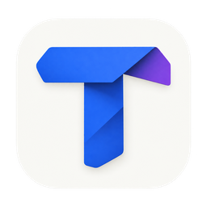

# Trace

Trace is a standalone macOS app for understanding and reviewing code changes.
It combines file TLDRs, the PR’s main end-to-end journey, interactive behavior
flows, findings, and wide Git diffs in one workspace. Built with Tauri 2, React,
TypeScript, and Rust.

## Design direction

Trace uses **Folded Blueprint**: a cobalt-blue and violet folded **T** on a
porcelain tile, representing a plan becoming an implementation. The same icon
appears in the macOS app bundle, the workspace, and the browser preview.

The [design-system proposal](docs/trace/DESIGN-SYSTEM-PROPOSAL.md) defines a shared
visual language for reviews and the proposed **Planner** workflow: neutral
surfaces, blue actions, readable code, and explicit observed/proposed/evidence
states. Planner remains a design proposal; the review features below describe
the current app. See the [branding guide](docs/trace/branding/README.md) for the
selected artwork and icon exports.

## Start the app

Download the latest macOS build from [GitHub Releases](https://github.com/evilpeach/trace/releases/latest).
Choose **aarch64** for Apple Silicon or **x64** for Intel; macOS 12+ is required.
The initial builds are ad-hoc signed and not Apple-notarized. Installation notes
are included with each release.

To build from source:

Install Node.js 22.12+, Rust 1.91+, and Xcode Command Line Tools, then run from the
repository root:

```sh
npm install
npm run dev
```

Choose **Explore an example** for the bundled synthetic walkthrough, or **New
review** to connect a repository/worktree and select a GitHub PR or branch
comparison. Trace can discover a PR stack, prepare a separate report for each
selected PR, and hand the requests to Codex or Claude in Terminal with model and
effort choices. PR lookup requires an authenticated GitHub CLI; agent handoff
requires the chosen CLI to be installed and signed in.

You can also import an existing `.trace.json` report. The portable
[report skill](docs/trace/skills/trace-report/SKILL.md) gives agents the format and
validation steps. Python 3 with `jsonschema>=4.18` is required for its validator.
Local review reports and agent output belong in `.trace/` and are ignored by Git.

## Review workspace

- Projects group repositories, PRs, and report snapshots. Automatic detection
  brings new reports into an inbox without interrupting your active review.
- Overview introduces the change and its main journey. Files combines per-file
  explanations, dependency rounds, split/unified diffs, and source evidence.
- Flows provides zoomable before/after diagrams with a resizable code inspector.
  Findings shows severity, evidence, and your own review decisions.
- Sticky file context, collapsible sidebars, and Focus diff leave more space for
  code. GitHub and VS Code actions open the relevant source.
- Review progress, resumable reading positions, and checkpoints keep track of
  what changed since your last review.
- Settings includes Light/Dark/System appearance, separate interface and code
  sizes, diff preferences, automatic detection, and editable keyboard shortcuts.
  Defaults include **⌘B** for the sidebar, **⌘[ / ⌘]** for navigation, and **⌘,**
  for Settings.

Reports describe immutable base/head comparisons. Your decisions are stored
separately. Trace validates the report and local source before showing committed
code or enabling verified editor links. It does not apply fixes or post comments.

See the [app guide](apps/trace/README.md) for creation, discovery, source validation,
keyboard shortcuts, storage, and current limitations.

## Build and check

```sh
npm run check
npm test
npm run test:native
npm run test:contract
npm run build
open apps/trace/src-tauri/target/release/bundle/macos/Trace.app
```

`test:contract` runs the portable Python validator against the bundled synthetic
report. `build` creates a local app for the current Mac’s architecture. CI tests
pull requests and `main`; version tags build ad-hoc-signed Apple Silicon and Intel
downloads and publish a release after all checks pass. Developer ID signing,
notarization, universal builds, and automatic updates are not yet configured.
Existing `trace:*` command aliases remain available.

See [testing and releases](docs/trace/RELEASING.md) for local test dependencies,
version management, and the release process.

For a browser-only preview:

```sh
npm run dev:web
```

Open `http://127.0.0.1:1420`. The preview supports the example and report import;
local Git, CLI handoff, and native persistence require the desktop app.

## Repository layout

| Path                                                                        | Purpose                                                              |
| --------------------------------------------------------------------------- | -------------------------------------------------------------------- |
| [`apps/trace`](apps/trace/README.md)                                        | React workspace, Tauri/Rust backend, and native integration tests    |
| [`packages/report-contract`](packages/report-contract)                      | Shared report types, validation, and contract tests                  |
| [`docs/trace`](docs/trace/README.md)                                        | Product specification, research, and historical HTML prototypes      |
| [`docs/trace/skills/trace-report`](docs/trace/skills/trace-report/SKILL.md) | Portable agent skill, schema, synthetic report, and Python validator |

The [documentation index](docs/trace/README.md) distinguishes current behavior
from design proposals and prototype demonstrations.
