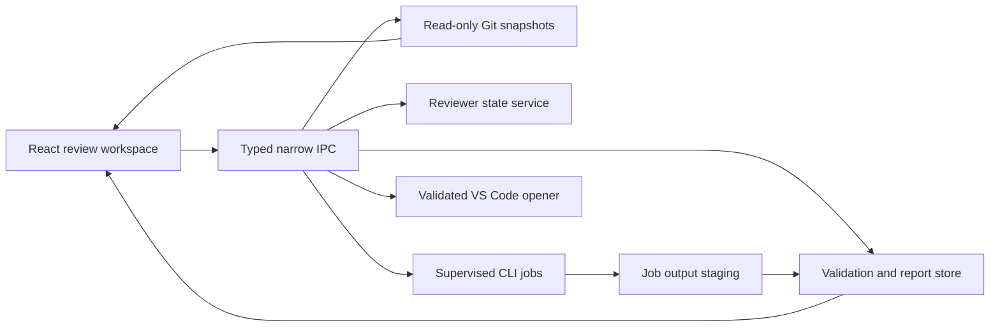

# Trace — macOS review workspace

Status: **Product target and implementation specification**, updated 28 September 2026. This document describes the broader product target and acceptance gates, not a checklist of shipped features. The current Trace app and its limitations are documented in the [app guide](../../apps/trace/README.md).

The app currently provides report preparation and external CLI handoff. Native process supervision, streamed agent logs, in-app cancellation, GitHub Viewed synchronization, and signed release distribution remain future work. Sections describing those capabilities are requirements for later milestones. The accepted onboarding increment below records the implemented handoff boundary.

Companion artifacts: [interactive HTML prototype](prototypes/trace-prototype.html), [report contract](REPORT-CONTRACT.md), and [agent report skill](skills/trace-report/SKILL.md). The contract is authoritative for field names, required data, validation, and examples; this document specifies product behavior.

## 1. Product intent

Trace helps a developer understand an entire change before deciding whether its findings and behavior are correct. It is a standalone Mac app with enough room for source comparisons, explanations, and cross-file stories in one window.

The core loop is **understand the change → trace its behavior → inspect exact code → record a decision → revisit only what changed**. A source link opens VS Code at a local file and line. Reading and reviewing happen in Trace; opening an editor is optional.

Primary user: an individual developer reviewing an AI-produced report for a local Git branch or GitHub PR. Secondary user: an author checking their own change before requesting review. Trace is initially a local review workspace, without team accounts or hosted report storage.

The user should be able to answer these questions without reading every line first:

- What does this PR change for a user or caller, and what remains uncertain?
- What changed in each file, why does it matter, and which behavior uses it?
- Which files cooperate in each flow, including failure, retry, and cancellation paths?
- What evidence supports a finding, and what has actually been tested?
- What did I already review, and what became stale after regeneration?

## 2. Scope and success criteria

### V1 target

- A macOS Tauri 2 shell, React/TypeScript interface, and native repository selection.
- Local repository registration and import of a validated Trace report.
- Reviews of immutable Git base/head snapshots for a branch or PR.
- Overview, Files, Flows, and Findings, with a project primer and optional value derivations.
- A TLDR for every changed file and every authored flow; explicit coverage gaps.
- GitHub-style side-by-side and unified diffs inside Trace, including a multi-file stack.
- Source evidence linked to snapshot, path, side, and line; VS Code handoff for local source.
- File review marks, finding dispositions, flow review marks, checkpoints, and stale-state handling.
- A portable agent skill and validator; manual generation works without agent integration.
- One supervised local CLI review job per repository, with logs, cancellation, and recoverable errors.
- Optional, separately enabled GitHub Viewed synchronization for a verified PR/head.
- Read-only proposed fixes and comment/context copying.

### Outside V1

Working-tree or staged-change review; applying fixes; commits, pushes, merges, or PR comment publication; a built-in code editor; cloud agent execution; hosted collaboration; Windows/Linux; a permanent system daemon; arbitrary plugin execution; repository-wide call-graph indexing; automatic approval decisions; and an automatic updater.

A flow diagram represents an authored, evidence-backed explanation. It is not a claim that Trace statically analyzed every possible execution path.

### Release goals

On an agreed Apple Silicon reference machine, a 100-file/10,000-line-change fixture opens its overview within 2 seconds after validation; a cached file diff appears within 150 ms. These are proposed test targets, not measured claims. Large files render on demand, so opening a review does not load all blobs into the WebView.

The primary usability gate is practical: a reviewer can explain the main change, inspect a flow across at least three files, triage a finding, open a source line in VS Code, and resume a regenerated report without losing valid progress.

## 3. Trace feature and design decisions

Trace separates report explanation, immutable source evidence, and reviewer-owned decisions. The following decisions guide the product target; the app guide remains the authority for current availability.

| Area                            | Product decision                                                                                                                                                                      |
| ------------------------------- | ------------------------------------------------------------------------------------------------------------------------------------------------------------------------------------- |
| Explanation and evidence        | Lead with a file or finding TLDR, a concrete example, and a causal sequence. Keep exact snapshot evidence beside the reasoning.                                                       |
| Stable identities and decisions | Keep file, flow, and finding IDs stable across regenerated reports. Store reviewer dispositions independently from authored content and priority.                                     |
| Dependency rounds               | Offer a reading order with file-specific focus and exit questions. Give every changed file its own change TLDR; focus alone does not explain the change.                              |
| Exact source comparisons        | Read immutable Git base/head blobs through the native backend and render split/unified diffs in React. Account for additions, deletions, and renames explicitly.                      |
| Review continuity               | Use application-owned state, versioned fingerprints, and saved checkpoints to distinguish changed code, changed guidance, and changed flow evidence.                                  |
| Cross-file behavior             | Explain before/after stories with meaningful steps, named branches, and source references. Keep suggested reading order distinct from execution order.                                |
| Optional project context        | Include project-specific terms, invariants, and value derivations when supplied. Preserve formulas, units, source chains, consumer surfaces, and edge cases; hide absent content.     |
| Proposed fixes                  | Keep proposals read-only and distinct from committed code. Show whether validation was performed; a suggested check is not a passed test.                                             |
| Report creation                 | Prepare exact comparison requests, use job-specific output paths, and validate completed artifacts. External CLI handoff is the current boundary; supervised jobs are a later target. |
| Precise context sharing         | Copy useful comment or agent context with exact snapshot references. Sending or publishing requires an explicit user action through a supported integration.                          |
| Optional GitHub Viewed sync     | A future, separately enabled integration must verify PR identity and head and report sync failures independently from local progress.                                                 |
| Native workspace                | Use a resizable app window, app search, editable settings and shortcuts, and typed IPC. Editor handoff remains an optional source action.                                             |
| Versioned report compatibility  | Read supported formats without rewriting the original artifact. Expose missing coverage or ambiguous evidence instead of inventing content; unsupported versions remain explicit.     |

A valid report with `0 findings` must still show complete change coverage and authored flows. Trace must distinguish a successful zero-finding review from an empty, incomplete, or invalid report. Optional context remains visible only when the report supplies valid data.

## 4. Information architecture and window design

Trace opens a review in a native resizable window. The header shows repository, review title, exact snapshot pair, generation time, and report status. Review navigation is distinct from the file tree: **Overview / Files / Flows / Findings**.

The recommended **Workbench** layout has a collapsible 240–280 px navigation pane, a flexible main canvas, and an optional 300–360 px evidence inspector. At smaller widths the inspector becomes a drawer. A 1,440 px window should comfortably show two code columns; at approximately 1,000 px Trace offers unified diff instead of compressing both columns beyond readability.

The prototype also explores **Story canvas** (flow first, with source beneath) and **Brief** (editorial overview, with drill-down). These are structural alternatives for selection; V1 should ship one coherent default rather than maintain three independent products.

Hierarchy: change TLDR first, behavior and evidence second, detailed source on demand. Commit IDs and report provenance remain accessible without occupying every content row. Color indicates additions/deletions and status, accompanied by text and icons.

Global command search finds files, flow names, finding IDs, and commands. Search results retain their type and breadcrumb. Back/forward restores the prior tab, selection, inspector, and scroll position.

## 5. First-run and review lifecycle

1. **Choose repository** through the native folder dialog, or **Import report** to read explanations before connecting a checkout.
2. Trace validates the directory as a Git repository and registers its canonical root. A monorepo remains one repository; optional display grouping does not change path semantics.
3. Choose a branch comparison or supply a GitHub PR. Trace displays proposed base/head, comparison policy, and changed-file count before generation.
4. For branch review, resolve the selected refs and their merge base once; for PR review, resolve the PR base/head metadata and local objects. Record the effective comparison snapshots in the report. Moving refs never silently change an open review.
5. Generate externally with the skill or run a configured local CLI agent. The selected provider, working repository, snapshot pair, and output destination are shown before launch.
6. A valid completed report opens on Overview. A partially written artifact, invalid report, cancelled job, or failed generation never replaces the last valid report. A structurally valid report with explicitly incomplete coverage can be imported and is labeled incomplete.
7. Review by story, file order, or finding priority. Mark progress explicitly and save a checkpoint when useful.
8. Regenerate for a new head. Trace validates the new version, reconciles stable identities, and shows exactly what requires another look.

An imported report does not automatically run commands, open links, fetch a repository, or install a skill. Unknown newer contract versions show a readable version error and retain the original file for a compatible app.

### Report selection and persistence

The library groups reviews by repository identity and stable review identity, with dated report generations beneath them. It does not silently pick the newest JSON whenever a folder changes. A new valid generation produces an update action; when a user-initiated job completes for the active review, Trace may activate it while preserving navigation.

Reports are portable, agent-authored artifacts. App state stores local checkout mapping, progress, preferences, job metadata, and checkpoints in the user's Trace application-support directory. A report cannot set an absolute checkout path or overwrite user state. Exporting a report excludes local paths, credentials, logs, and progress unless a future explicit export format includes them.

## 6. Overview: understanding before inspection

The overview contains a plain-language PR TLDR, intended outcome, before/after behavior, risk summary, and a suggested reading order. A coverage strip shows changed files explained, flows authored, verified findings, and validation evidence. Render the author's `summary.outcome` as `changes-requested`, `no-blockers-found`, or `incomplete`, with its explanation; it is not an app-generated approval. “No verified findings” is not presented as “safe to merge.”

Each highlighted change links to a flow or file. Each risk links to evidence or a finding. Executed checks use `provenance.checks` with `passed`, `failed`, or `not-run`; proposed checks remain separate in repair guidance. A generated report must not imply that narrative confidence equals test execution.

The primer explains project purpose, actors, key terms, invariants, and boundaries. Optional value derivations show a named value, consumer surfaces, formula, source chain, units, and edge cases. Every source-chain step can open the exact evidence in Trace and, if available, the local source in VS Code.

## 7. Files: TLDR and full diff together

Every changed-file row includes path, status, additions/deletions where known, a one-sentence TLDR of at most 280 characters, linked flows/findings, and review state. Binary and generated files remain in coverage. A missing explanation says “TLDR missing”; it never inherits a generic PR summary. Inventory coverage, per-file `analysis.status`, flow coverage, and human progress are separate counts.

Selecting a file opens its TLDR above the full base/head diff. A compact detail area explains responsibility, specific behavior changed, why it matters, and what to verify. Dependency rounds provide a recommended order, reason, and exit question; directory order is also available.

The main canvas supports single-file inspection and a multi-file stack, filtered by flow, round, or selection. Each stacked file retains a sticky path/TLDR header, collapse control, finding anchors, and review mark. Expanding one file must not jump another file's scroll position.

Diff requirements:

- Side-by-side old/new lines with independently correct line numbers; unified mode as an alternative.
- Expand unchanged context, wrap/no-wrap control, synchronized vertical scrolling, and clear hunk boundaries.
- Selecting an evidence reference highlights its side and line range without hiding surrounding code.
- Added/deleted files show an intentional empty opposite side; renamed files show both paths and actual content change.
- Binary, oversized, symlink, submodule, and unsupported encoding changes get explicit metadata views with object identity. Do not manufacture text or treat unreadable content as unchanged.
- Report snippets are excerpts; committed Git blobs are the authority for the full diff. A mismatch becomes an evidence warning.
- “Mark reviewed” is manual. Scrolling through a file or opening it is not proof of review.

V1 uses bounded, lazy blob reads and virtualized diff rows. The renderer must benchmark long lines, a 10,000-line hunk, and a large file list before selecting a production diff component.

## 8. User journeys: behavior across files

A flow is a named behavior with an actor/trigger, starting conditions, intended outcome, a change TLDR, and structured before/after graph snapshots. A linear graph may be rendered as an ordered trace. Examples include “submit an order,” “restore a session,” or “cancel a pending request.” It may cross changed and unchanged source files. The contract's separate `contextFiles` inventory anchors unchanged supporting code without adding it to changed-file counts or progress.

The UI calls these **User journeys**; its count indicates authored journeys, not
issues or severity. Optional report-level `mainJourney: { flowId, why }` explicitly
identifies the PR’s central end-to-end behavior. The referenced journey is shown
first with a **Main journey** badge and **Why this matters** explanation. This is
the report author’s designation, not an automatic criticality ranking. Existing
saved selections remain intact. Selecting another journey must not label that
journey as main. Reports without the field remain valid and clearly say that a
main journey has not been identified; array order alone never establishes importance.
Risk stays in linked findings. A designation or rationale change invalidates the
affected journey’s reviewed guidance, using the existing stale-state mechanism.

Every flow card starts with its own TLDR: what the behavior does and how this change affects it. The detail view places **Before / After** next to the graph and includes involved files, findings, invariants, and verification notes.

Nodes represent meaningful steps or decisions, not every function call. Edges have conditions when conditional. Changed steps are distinguished from supporting unchanged code. A decision exposes named branches such as success/failure, authenticated/expired, or cancel/continue; loops have a visible exit condition.

Selecting a node opens its explanation and source references in the inspector. Selecting its file opens the corresponding diff without losing the flow selection. A linear accessible transcript contains the same node, edge, and branch information as the visual diagram.

Flow content must distinguish observed code behavior from inference and proposal. Missing evidence is visible. A confidence label never substitutes for source references. Flows unaffected by the change do not need to be exhaustively documented; every affected behavior the report claims to explain does.

If a file is outside authored flows, its analysis or coverage note must state why, such as documentation, generated output, or standalone utility change. A flow with no detected bug is still useful and must remain visible when the findings queue is empty. Empty flows with `flowAnalysis:not-assessed` mean “Flows not assessed”; an established absence of behavioral changes uses `complete` plus an explanation. A new flow's before snapshot can be `not-applicable`; unavailable snapshots remain explicit and make flow coverage partial.

## 9. Findings and proposed fixes

The queue sorts by explicit review priority `P0` through `P3`, then report order, with filters for file, flow, assessment, disposition, and staleness. Unclassified legacy findings have null priority and appear in a labeled unclassified group. Selecting a finding opens its primary defect anchor and presents: concise claim, concrete trigger, expected versus actual behavior, causal steps, impact, evidence, and suggested remedy.

V1 has no separate severity field. Impact belongs in the explanation; legacy severity must not be guessed into priority. Stable identity does not change when priority changes. Agent `assessment` is `supported`, `needs-verification`, or `refuted`; it is distinct from reviewer disposition. Refuted hypotheses do not inflate the active-finding count, and needs-verification items do not count as verified findings.

Dispositions are **Confirmed**, **Fixed**, **Disputed**, and **Needs test**, with optional reviewer notes. “Fixed” records the reviewer's decision; it does not mean Trace applied a change or independently proved the fix.

Proposed fixes contain an optional standard unified patch against `comparison.head.oid`. Trace can preview current/proposed sides only after resolving that head and checking patch context in memory; otherwise it displays the inert patch and explains why a contextual preview is unavailable. `proposedFix.validation` lists proposed checks, not executed results; actual results belong in provenance. Illustrative fragments remain prose/code with `patch:null`. No apply button is present in V1.

Copy comment produces useful Markdown containing identity, claim, location, reproduction/impact, and suggestion. Copy context includes the selected finding/flow and exact snapshot references for another agent. Neither action sends a message or posts a review.

## 10. Review state, regeneration, and checkpoints

Report content and reviewer state have separate owners. Agents author the report; Trace writes reviewer state. The app validates and fingerprints the report before reconciling state in a single transaction. Evidence fingerprints include referenced unchanged context files as well as changed files; a dependency change can invalidate a conclusion even when its primary file stays the same.

| Event                                                     | Required behavior                                                          |
| --------------------------------------------------------- | -------------------------------------------------------------------------- |
| Same identity and same code/guidance                      | Retain reviewed/disposition state.                                         |
| File code changes                                         | Retain history; mark code stale.                                           |
| File guidance changes but code does not                   | Mark guidance changed; do not call the code new.                           |
| Flow graph, explanation, or evidence changes              | Mark flow stale with the changed category.                                 |
| Finding evidence, causal chain, or recommendation changes | Retain previous disposition as history; require reconfirmation.            |
| New finding/file/flow                                     | Start unreviewed.                                                          |
| Removed finding/file/flow                                 | Retain historical decision outside active counts.                          |
| Confirmed rename                                          | Carry eligible history through the explicit mapping; recheck fingerprints. |
| Uncertain identity match                                  | Show migration ambiguity; do not silently transfer a decision.             |

A checkpoint captures the active report generation, exact head, and file fingerprints. “Changed since checkpoint” compares against that checkpoint, not an inferred branch name. A new report does not overwrite the saved checkpoint. Saving a new one is explicit.

Progress counts eligible items and identifies missing coverage. A previously reviewed but stale file counts as needing attention. Reset progress is reversible during the current session or requires a confirmation naming the affected review; it never deletes reports.

State writes use a native single-writer service with atomic transactions. A second window observes updates. The design must not rely on independent read/merge/write operations that can race on the same item.

### Proposed state persistence

Use a private SQLite database, `trace.sqlite3`, in the native app's resolved application-support directory. It contains no agent credentials. Migration runs transactionally before writes; an unsupported newer database version opens a recovery message and is never overwritten. The original database is backed up before a destructive migration. Imported report generations remain immutable JSON files in app-managed storage, with their digest and location indexed in SQLite.

The stable review key is `(repository.id, reportId)`. An immutable generation key is SHA-256 of canonical parsed report JSON: recursively sorted object keys, array order preserved, encoded as UTF-8. Filename and `generatedAt` alone are not identities. A local `checkoutId` maps repository identity to a canonical root and is kept separate from the review key, so selecting another valid clone does not reset progress.

| Private record    | Key and stored content                                                                                                                                                                       |
| ----------------- | -------------------------------------------------------------------------------------------------------------------------------------------------------------------------------------------- |
| Review            | Review key; active generation digest; review revision; selected checkout ID.                                                                                                                 |
| Entity decision   | Review key + kind (`file`, `flow`, `finding`) + stable entity ID; reviewed flag or disposition; note; last accepted code/guidance fingerprints; generation digest; timestamp; item revision. |
| Decision history  | Append-only prior decisions and invalidation reasons; removed entities remain historical.                                                                                                    |
| Checkpoint        | Review key; generation digest; base/head OIDs; file ID/path/fingerprint map; timestamp.                                                                                                      |
| Local integration | Checkout roots, configured provider IDs, and per-PR Viewed sync preference/status.                                                                                                           |
| Job               | Job ID, review key, checkout ID, comparison, status, log/staging paths, and process ownership metadata; stale running records become interrupted on restart.                                 |

Native code computes fingerprints, never trusting report-supplied hashes. Code fingerprints include status, side-specific path, mode, and blob IDs; guidance fingerprints include entity explanations and relevant round/flow content; evidence fingerprints cover referenced blobs and ranges. Use a versioned canonical encoding so an algorithm change triggers an explicit reconciliation migration rather than silently losing decisions.

Writes carry `expectedItemRevision` (zero for a new decision); the single writer compares and increments it in one transaction. Different-item writes both succeed. A same-item conflict returns the current value for deliberate retry instead of silently overwriting another window. Checkpoint replacement uses the equivalent review revision. Publish state events only after commit; a failed write remains visibly unsaved.

GitHub Viewed is off by default. When enabled, Trace records the local mark immediately, verifies the repository/PR/head mapping, then syncs remotely. A head mismatch pauses synchronization; network/auth failures leave local progress intact and expose a retry. It does not post comments or change PR approval state.

## 11. Agent report workflow

The [Trace skill](skills/trace-report/SKILL.md) is a repository-local deliverable in this proposal; it is not installed into the user's global skills automatically. It must work with an agent that can inspect a Git checkout and write JSON, without depending on a particular chat product.

The workflow is: read the contract → resolve exact snapshots and mechanically collect change inventory → inspect code/callers → author all file TLDRs and affected flows → verify findings → preserve stable identities from the prior generation → validate → publish one completed artifact atomically.

The agent must not invent findings to populate the UI, claim unrun tests passed, omit unchanged source needed to explain a flow, or modify review progress. All unknowns and coverage omissions remain explicit. Validation checks structure and consistency; it cannot prove that an AI explanation is correct.

Manual flow is first-class: generate a report externally, validate it, then import it. The native runner adds convenience using the same output contract. It does not create a second report dialect.

Future report-format adapters must preserve supported findings, file groups, primer content, derivations, and proposals without rewriting original artifacts. Reading guidance must not become a claimed behavior graph. Missing per-file TLDRs or structured flows remain incomplete coverage; adapters must never synthesize factual explanations from short focus text. Missing comparison commits or ambiguous evidence require resolution instead of guessed source anchors. The current app accepts the Trace report contract.

## 12. Native review jobs

Each job has a unique ID, captured repository mapping, immutable snapshots, provider/executable identity, output destination, start/end times, structured status, and a bounded log. One running job per repository is sufficient for V1; other requests queue or show the existing job.

Lifecycle: **preflight → queued → running → validating → completed**, with **cancelling → cancelled**, **failed**, and **interrupted** exits. Status never changes to completed merely because some JSON appeared on disk.

Preflight checks Git objects, writable output, available executable, provider configuration, and a supported read-only review mode. Source changes are outside the review job's scope. Provider-specific filesystem/network permissions must be documented and displayed; a prompt asking an agent to be read-only is not enforcement.

The runner passes argument arrays to an explicitly configured executable, with a fixed working directory and bounded environment. Report text cannot become a shell command. Output is written to a job-specific temporary artifact; completion requires process success, complete contract validation, matching review/snapshot identity, and atomic promotion to the final artifact. Job ownership is checked through native staging metadata, not a new field in the portable report schema.

Cancellation signals the owned process group, waits briefly, then escalates termination if needed. Keep bounded diagnostic logs and any incomplete artifact separate from the valid report. Late process events or files from a cancelled job cannot activate a report. App quit with an active job offers keep-open or cancel-and-quit; background operation after quit is deferred.

Authentication remains with the selected CLI and its normal credential store. Trace never embeds credentials in reports, prompts, browser state, or logs. Missing/expired auth opens clear setup instructions and an explicit retry; importing and reading reports continues to work offline.

Local agents are not automatically sandboxed by Tauri. Tauri permissions constrain WebView access to native APIs; they do not provide a sandbox around arbitrary child processes. Before shipping a provider adapter, verify its real sandbox/read-only behavior, cancellation, auth, and output lifecycle on macOS.

## 13. Architecture and trust boundaries

Proposed package boundaries: `apps/trace` for React and Tauri, `packages/report-contract` for schema/types/fixtures, `packages/review-core` for pure identity/fingerprint/state logic, and `skills/trace-report` for the distributable skill. These are target implementation locations, not directories created by this spec.

React owns rendering, navigation, keyboard actions, and transient UI state. Rust owns repository handles, Git/process access, native dialogs/openers, persistent state, and validation at the privilege boundary. Reuse pure TypeScript helpers where sound; extract their behavior into shared fixtures rather than copying VS Code imports.

IPC exposes operations such as register repository, import report, list changed files, read a blob/diff, start/cancel a known job, set a disposition, save a checkpoint, and open a validated source reference. It does not expose arbitrary shell commands, unrestricted filesystem reads, arbitrary URL opening, or a renderer-selected executable.

### Proposed internal IPC contract

These request/response shapes are private app APIs, separate from `.trace.json`. Handles are opaque, issued by native code, and scoped to the caller's registered repository/report. A `reportHandle` binds one immutable generation; the frontend cannot replace its OIDs or paths. Objects below show request and successful response payloads; names are proposed implementation interfaces.

| Command                | Request → success response                                                                                                                                                                                                   |
| ---------------------- | ---------------------------------------------------------------------------------------------------------------------------------------------------------------------------------------------------------------------------- | ------------------------------------------------------------------------------------------------------------------------------- |
| `choose_repository`    | `{}` → `{checkoutId, repositoryId, displayPath}` from a native dialog and verified registration.                                                                                                                             |
| `import_report`        | `{checkoutId?: string}` → `{reportHandle, generationDigest, coverage, warnings}`; native dialog supplies the path, then structural/semantic validation precedes import.                                                      |
| `list_refs`            | `{checkoutId}` → `{refs:[{refHandle,label,oid}]}`; handles are issued after native Git resolution.                                                                                                                           |
| `resolve_comparison`   | `{checkoutId, baseRefHandle, headRefHandle, policy:"merge-base"                                                                                                                                                              | "direct"}`→`{comparisonHandle,baseOid,headOid,inventoryCount}`; the recorded result is always a direct two-snapshot comparison. |
| `resolve_pull_request` | `{checkoutId,prUrl}` → `{comparisonHandle,repositoryId,prNumber,baseOid,headOid}` after explicit URL/repository validation and authenticated metadata access; missing local objects require a separate user-initiated fetch. |
| `read_diff`            | `{reportHandle,fileId,contextLines,cursor?: string,requestId}` → `{requestId,base,head,hunks,nextCursor?,limitations}` with bounded native-derived sides.                                                                    |
| `read_evidence`        | `{reportHandle,evidenceId,requestId}` → `{requestId,side,oid,path,startLine,lines,verification}`.                                                                                                                            |
| `set_decision`         | `{reportHandle,kind,entityId,decision,note?,expectedItemRevision}` → `{itemRevision,reviewRevision,persistedDecision}`; validate allowed decisions against the entity kind.                                                  |
| `save_checkpoint`      | `{reportHandle,expectedReviewRevision}` → `{checkpointId,reviewRevision}`; native code computes the fingerprint map.                                                                                                         |
| `start_review`         | `{checkoutId,comparisonHandle,providerId,reportId}` → `{jobId,status}`; provider ID selects a preconfigured adapter/executable, and native code selects staging paths.                                                       |
| `cancel_job`           | `{jobId}` → `{jobId,status}`; idempotent, restricted to a job owned by this app.                                                                                                                                             |
| `open_source`          | `{reportHandle,evidenceId,checkoutId}` → `{opened:boolean,reason?: string}` after snapshot-to-working-tree verification and native URL construction.                                                                         |
| `cancel_request`       | `{requestId}` → `{cancelled:boolean}` for an owned outstanding read.                                                                                                                                                         |

`set_decision.decision` is `reviewed` or `unreviewed` for files/flows, and `confirmed`, `fixed`, `disputed`, `needs-test`, or null (clear disposition) for findings. `contextLines` is an integer from 0 to 200; larger context is paged with a native-issued cursor. Native command schemas reject unknown properties and cross-report entity IDs. The renderer never supplies source text, fingerprints, SQL, process arguments, or persistence paths.

Responses use a discriminated envelope, `{ok:true,data}` or `{ok:false,error:{code,message,retryable,field?,details?}}`. Initial error codes cover `INVALID_REPORT`, `UNSUPPORTED_VERSION`, `UNMAPPED_REPOSITORY`, `MISSING_OBJECT`, `STALE_GENERATION`, `STATE_CONFLICT`, `LIMIT_EXCEEDED`, `AUTH_REQUIRED`, `PROVIDER_UNAVAILABLE`, `CANCELLED`, and `IO_ERROR`. Details contain bounded diagnostics, never credentials or unrestricted process output.

Events carry `{eventId,sequence,kind,jobId?,reviewKey?,generationDigest?,payload}`. Job events are sequenced per job; state events carry committed revisions. The UI ignores superseded read request IDs and reloads a snapshot after an event gap or restart. Outdated generation handles cannot mutate the active generation's decisions; native code returns `STALE_GENERATION` and lets the user reopen the matching history item or refresh.

Each command validates its arguments and authorization against app-owned repository/report handles. Object IDs must resolve to the expected type; repository paths must remain within the registered root after canonicalization. Symlink source links cannot escape that boundary. Resource reads have byte/time limits and cancellation.

Use a bundled local WebView, restrictive content security policy, no remote scripts/fonts, escaped text, and sanitized supported Markdown. Disable raw report HTML and executable diagram definitions. Reports and repository content are untrusted data. Explicit Tauri capabilities and custom-command scoping must match the small IPC surface; permissive Rust commands would defeat frontend restrictions. [Tauri capabilities](https://v2.tauri.app/security/capabilities/).

V1 uses the Rust process supervisor directly; a persistent daemon is unnecessary. If a later bounded helper is bundled as a sidecar, package its architecture-specific binary, define its allowed arguments, and supervise its lifecycle. The official sidecar mechanism supports this packaging model. [Tauri sidecars](https://v2.tauri.app/develop/sidecar/).

### Git snapshots and local checkout mapping

Store portable repository identity and relative paths in the report. Store this Mac's absolute checkout root only in app state. Two clones can map to the same logical repository, but Trace requires the user to choose which checkout opens in the editor.

Read exact blobs from the recorded Git objects, using argument arrays and no external diff/textconv execution. Use structured/NUL-delimited Git output for paths. Never run repository hooks or evaluate filenames. Missing objects produce a recoverable “snapshot unavailable” state; a fetch is an explicit action showing remote and requested refs.

A local checkout may be on a different commit or contain uncommitted changes. The snapshot diff stays unchanged. Open a working-tree evidence line only when its path and blob match the evidence snapshot or a verified line mapping exists. Otherwise explain the mismatch and keep the committed source in Trace. Deleted/base-only references without a verified mapping offer a snapshot path/line copy; a warning alone is insufficient to call an unverified editor jump exact.

### VS Code deep links

For a validated local source reference, construct `vscode://file/{absolute path}:{line}` using URL-safe path encoding and a positive integer line. The slash preceding an absolute macOS path must be normalized correctly; spaces, `#`, `%`, Unicode, and colon-containing filenames need fixture tests. Never trust a report-provided absolute path or custom URL.

The user-facing action is **Open in VS Code**. Native code checks the selected mapping and local file before asking macOS to open the generated URL through the opener integration. If VS Code is absent or the OS rejects the link, show a copy-path fallback. Browser preview cannot verify OS handoff. The URL scheme and optional line/column form are documented by [VS Code](https://code.visualstudio.com/docs/configure/command-line#_opening-vs-code-with-urls); opening URLs from Tauri uses its [opener plugin](https://v2.tauri.app/plugin/opener/) with explicit scope for this scheme.

## 14. Error, accessibility, and operational requirements

| State                            | What the user sees and can do                                                                                    |
| -------------------------------- | ---------------------------------------------------------------------------------------------------------------- |
| No repository/report             | Choose repository, import report, or read generation instructions.                                               |
| Valid zero-finding report        | Show its actual coverage and “No verified findings”; an empty finding list does not establish complete analysis. |
| Invalid/unsupported report       | Precise field/version error; retain current report; choose another file.                                         |
| Partial coverage                 | Counts and explicit missing explanations; request regeneration.                                                  |
| Unmapped/moved checkout          | Explanations remain readable; reconnect local repository.                                                        |
| Missing snapshot                 | Explain affected diff; fetch explicitly or select a suitable clone.                                              |
| Corrupt/mismatched evidence      | Flag reference and keep source view honest; no silent substitution.                                              |
| CLI unavailable/auth required    | Provider setup and retry; manual import still available.                                                         |
| Job failed/cancelled/interrupted | Status, useful log tail, preserved prior report, retry as a new job.                                             |
| State storage failure            | Visible unsaved mark and retry; never display a persisted success.                                               |
| GitHub sync failure              | Local progress preserved; remote status and retry.                                                               |

All controls have accessible names and visible focus. Keyboard navigation works without global single-letter shortcuts while typing. Proposed commands: ⌘O import, ⌘K search, ⌘1–4 sections, arrow navigation within focused lists, Escape close inspector/dialog. Final macOS menu bindings must avoid native text-navigation conflicts.

Respect text scaling and reduced motion; code can scroll horizontally. Diagrams have equivalent text. Status uses labels in addition to color. Test light/dark themes, a small laptop viewport, and VoiceOver for the primary loop.

Logs rotate locally with a documented retention limit and a user-visible clear action. Diagnostic export is deliberate and previews included material. No telemetry or report upload is enabled in V1.

## 15. macOS packaging and distribution

Use a development `.app` for native spikes, then a signed and notarized direct-distribution app/DMG for V1. Tauri documents the Developer ID and notarization route for macOS distribution. [Tauri macOS signing](https://v2.tauri.app/distribute/sign/macos/).

Apple Silicon is the initial validation target. Intel support and minimum macOS version remain release decisions after testing the chosen Tauri/WebKit features and provider binaries. Do not promise compatibility before a real build matrix passes. Avoid a Mac App Store commitment until the CLI execution model is evaluated against its distribution constraints.

Release checklist: stable bundle identifier, Trace icon/name, versioned contract migration, signed app and any bundled executables, notarization/stapling validation, clean-machine launch, report import/file association, permission and quarantine behavior, deep links, job termination, and rollback-safe state migration. Manual download/install handles updates in V1.

## 16. Delivery phases and acceptance gates

| Phase                        | Deliverable                                            | Gate before proceeding                                                                                                           |
| ---------------------------- | ------------------------------------------------------ | -------------------------------------------------------------------------------------------------------------------------------- |
| 0 — Product proof            | This spec, contract/skill, working HTML directions     | Inspect all primary views and simulated interactions; select a layout.                                                           |
| 1 — Contract/core            | Versioned schema, import adapter, identity/state logic | Positive/negative fixtures cover empty findings, all paths/statuses, missing coverage, invalid references, and regeneration.     |
| 2 — Native vertical slice    | Repository picker, exact diff, VS Code link            | Signed development app reads a real base/head comparison and opens the expected file/line on macOS.                              |
| 3 — Review workspace         | Overview, Files, Flows, Findings, progress             | Complete a three-file flow and finding decision; restart and recover state; regenerate and see correct staleness.                |
| 4 — Runner and optional sync | Supervised CLI adapter, cancellation, GitHub Viewed    | Exercise success, invalid output, nonzero exit, auth expiry, cancellation with descendants, stale PR head, and offline recovery. |
| 5 — Distribution             | Signed/notarized release candidate                     | Clean-machine install and main-loop accessibility/performance gates pass.                                                        |

Detailed acceptance scenarios:

1. A valid report with no findings still lists every changed file and authored flow.
2. Each file and flow has a distinct factual TLDR; missing legacy content is identified rather than invented.
3. A flow branch navigates to the correct before/after source side across three files and back without losing context.
4. Diff contents remain identical after switching the local checkout to another branch or editing a local file.
5. Added, deleted, renamed, binary, large, symlink, and Unicode/space-containing paths render truthful states.
6. Import rejects traversal paths, unsupported schema versions, dangling references, and executable report content without affecting the last valid report.
7. Same-generation replay preserves marks; changed code, guidance, and flow evidence produce the intended separate stale states.
8. Two windows updating different items preserve both decisions; a same-item update has deterministic conflict behavior.
9. Cancellation terminates owned descendants and prevents late artifacts from becoming a completed report.
10. A provider exit code of zero plus invalid/partial JSON fails validation; valid-looking JSON plus a failed job does not auto-complete.
11. VS Code handoff works with encoded paths; deleted/base-only references offer an honest fallback; a mismatched checkout is visible.
12. A failed GitHub Viewed request does not revert local progress or change PR review status.
13. Keyboard and VoiceOver users can select a file, inspect evidence, make a disposition, and return to the overview.
14. A proposed fix cannot edit the repository through any UI or IPC path.

The HTML prototype proves layout, navigation, filtering, sample diff presentation, and simulated review interactions. It does **not** prove native file access, Rust IPC, Git accuracy, process isolation/cancellation, agent authentication, GitHub synchronization, signing, or OS deep-link behavior. Those require the native gates above.

## 17. Decisions and remaining risks

Recommended defaults are Workbench, local-first report files, application-owned reviewer state, explicit immutable comparison snapshots, read-only review, manual import before runner integration, and direct macOS distribution.

Open implementation decisions: final bundle identifier; minimum macOS and Intel support; diff rendering library after performance/accessibility spike; SQLite binding and migration tooling; first supported CLI provider and its actual sandbox controls; legacy identity migration policy; and exact report size limits established by fixtures.

Main product risk: attractive diagrams can overstate what an agent proved. Address it with visible evidence, authored-versus-verified distinctions, coverage reporting, and exact snapshot navigation. Main engineering risks are large-diff performance, process lifecycle correctness, schema migration, and confusing local editor state with the reviewed snapshot. Each has an explicit acceptance gate above.

## Accepted onboarding increment — 27 September 2026

The selected direction is **B: Quick composer**, followed by persistent review
activity. The current increment implements exact comparison setup, exported report
toolkit, and validated external-agent output. It keeps report reading/navigation
independent from new-review creation.

Selecting a GitHub PR reveals its branch-linked open PR stack, with all discovered
PRs selected initially. Users may choose a subset. Each selected PR produces its own
immutable report, exact merge-base/head comparison, findings, and reviewer state.
Stack discovery must disclose bounds/unsupported links and refuse ambiguous or
cyclic selections; it must never silently include unrelated branches. Resolving a
selection rechecks current PR metadata and local Git objects without fetching or
switching the checkout.

**Run with Codex** and **Run with Claude** open the installed CLI in macOS Terminal
with the prepared request, using its ordinary account/configuration/approval flow.
The launch panel lets users choose the agent, model, and supported effort before
running. Model and effort choices persist per agent. CLI-default selections omit
overrides. Codex model capabilities come from its local catalog; Claude choices
use documented explicit model versions with a provider/account availability note.
Unsupported model-effort combinations are rejected by the native boundary.
Handoff history stores requested model/effort independently from report content.
The native application provides a privately stored, safely quoted launcher; no
executable, shell fragment, or arbitrary launch arguments come from report data.
A batch instructs the agent to produce the separate requested reports in order.
Missing CLI installations have explicit unavailable states and a copy-request
fallback. Trace records handoff time, not inferred analysis progress. Closing or
stopping Trace's wait does not stop the external CLI. Native process supervision,
streamed logs, and in-app agent cancellation remain a later milestone.

Each request validates repository/report identity, exact commit pair, PR identity,
complete changed-file inventory, and Git evidence before becoming ready. It never
auto-activates a received report or changes human review state. All pending requests
and handoff records survive restarts. Failed validation exposes a repair request;
manual import for a request enforces the same checks. Earlier runner sections in
this specification describe the broader product target, not a claim that this
Terminal handoff provides process supervision.
